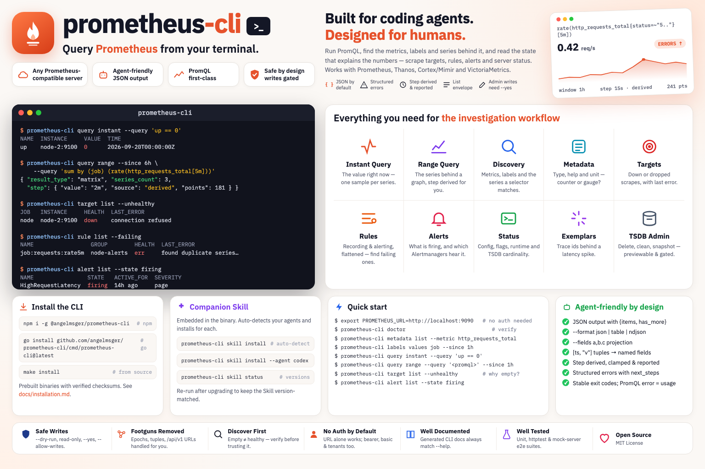

# prometheus-cli

[](https://www.npmjs.com/package/@angelmsger/prometheus-cli)
[](go.mod)
[](LICENSE)
[](https://angelmsger.github.io/prometheus-cli/)

> Query Prometheus from your terminal — built for coding agents.

`prometheus-cli` lets coding agents (Claude Code and others) — and humans — query
[Prometheus](https://prometheus.io/) for a developer's investigation workflow:
run PromQL instant and range queries, discover the metrics, labels and series
behind them, and read the operational state that explains the numbers — scrape
targets, recording and alerting rules, active alerts and server status. It works
with any Prometheus-compatible server (Prometheus, Thanos, Cortex/Mimir,
VictoriaMetrics), returns agent-friendly JSON with structured errors, and ships a
companion Skill that teaches an agent how to use it.

📖 **Documentation site:** <https://angelmsger.github.io/prometheus-cli/>



```console
$ prometheus-cli query instant --query 'up == 0'
{
  "query": "up == 0",
  "result_type": "vector",
  "series_count": 1,
  "series": [
    {
      "name": "up",
      "metric": { "__name__": "up", "job": "node", "instance": "node-2:9100" },
      "value": { "timestamp": 1758326400.5, "time": "2026-09-20T00:00:00.5Z", "value": "0" }
    }
  ]
}
```

## Features

- **The query domain, first-class** — `query instant` for the value now,
  `query range` for the series behind a graph, plus `query exemplars` (trace ids
  behind a spike), `query format` and `query parse` (check an expression without
  running it). Expressions can be inline, `@file`, or `@-` from stdin.
- **The step is never implicit** — `--step` is optional. With none, the CLI
  derives a round resolution for the window; with one that would exceed
  Prometheus' 11,000-point ceiling, it raises it instead of sending a request
  that is guaranteed to fail. Every result reports the step, its `source`
  (`flag` / `derived` / `clamped`) and the point count.
- **Discover before you query** — an empty PromQL result is not an error, and is
  indistinguishable from "healthy" unless you checked. `metadata list` gives a
  metric's type and help text, `labels values` its label values, and
  `series list` exactly what a selector matches.
- **The CLI owns the footguns** — Prometheus' positional `[timestamp, "value"]`
  tuples become named fields with an RFC3339 instant beside the raw epoch;
  values stay strings so `NaN` and `+Inf` survive; targets and Alertmanagers are
  flattened into one list with an explicit `state`; rules are lifted out of
  their groups into one filterable row each; a base URL ending in `/api/v1` is
  trimmed back to the server root.
- **Auth only when there is any** — Prometheus has no accounts, so `none` is the
  default scheme and `PROMETHEUS_URL` alone is a complete setup. `basic` and
  `bearer` cover proxied and hosted deployments, and `--tenant` sends
  `X-Scope-OrgID` for Cortex, Mimir and Thanos Receive.
- **Agent-friendly output** — JSON by default, an `{items, next, has_more}` list
  envelope, `--format json|table|ndjson`, and `--fields` projection to spend
  minimal context.
- **Errors as navigation** — every failure is structured
  (`category`/`code`/`hint`/`next_steps`) and mapped to a stable exit code, so a
  script or agent can branch and self-recover. A PromQL mistake classifies as a
  *usage* error, not a retryable one.
- **Layered write safety** — the three TSDB admin writes support `--dry-run`,
  honour a session read-only posture, require `--allow-writes` to override it,
  and the destructive ones additionally require `--yes` — which never prompts.
- **Flexible configuration** — CLI flags, environment variables, a `.env` file, a
  YAML config file, or an interactive wizard; multiple named server *contexts*;
  secrets stored in the OS keychain.
- **Companion Skill** — a `prometheus` Skill, embedded in the binary, that guides
  coding agents through the CLI.

## Installation

```bash
npm install -g @angelmsger/prometheus-cli
```

Other methods — `go install`, a prebuilt binary, or a source build — are in the
[installation guide](docs/installation.md).

Then finish setup:

```bash
prometheus-cli skill install                  # deploy the companion Skill
source <(prometheus-cli completion bash)      # shell completion
```

## Quick start

```bash
# a plain Prometheus needs only a URL
export PROMETHEUS_URL=http://localhost:9090
prometheus-cli doctor

# or configure it persistently
prometheus-cli config init --pretty

# what is down right now
prometheus-cli query instant --query 'up == 0'

# find the metric before querying it — the type decides the query
prometheus-cli metadata list --metric http_requests_total
prometheus-cli labels values job --match 'http_requests_total' --since 1h

# error rate over the last hour; the step is derived and reported back
prometheus-cli query range --since 1h \
  --query 'sum by (job) (rate(http_requests_total{status=~"5.."}[5m]))'

# an empty result? look at the scrape, not the query
prometheus-cli target list --unhealthy
prometheus-cli rule list --failing

# what is firing, and whether anyone is being told
prometheus-cli alert list --state firing
prometheus-cli alert managers
```

## Commands

The full reference, with every flag and example, is generated from the command
tree and published at <https://angelmsger.github.io/prometheus-cli/cli/>.

| Command | What it does |
|---|---|
| `query instant --query '<promql>'` | evaluate an expression at a single instant |
| `query range --query '<promql>' --since 1h` | evaluate it across a window at a resolution |
| `query exemplars --query '<selector>' --since 1h` | the trace exemplars behind a spike |
| `query format` / `query parse` | pretty-print an expression / show the server's parse tree |
| `series list --match '<selector>'` | what a selector actually matches |
| `labels list` / `labels values <label>` | label names / values (`__name__` is the metric list) |
| `metadata list` / `metadata targets` | a metric's type, help and unit, aggregated or per target |
| `target list [--unhealthy]` | scrape targets, active and dropped |
| `rule list [--failing]` | recording and alerting rules, flattened |
| `alert list` / `alert managers` | active alerts / the Alertmanagers they go to |
| `status config\|flags\|runtimeinfo\|buildinfo\|tsdb\|wal-replay\|notifications` | server state |
| `admin delete-series\|clean-tombstones\|snapshot` | TSDB writes (gated; see below) |
| `config init\|show\|contexts\|use-context\|set-context` | configuration and named contexts |
| `auth status\|guide\|login\|logout` | reachability and credential guidance |
| `doctor` | diagnose config, credentials, connectivity and the Skill |
| `skill install\|status\|path\|show\|uninstall` | manage the companion Skill |

## Configuration

Highest precedence wins: **flags → environment → `.env` → config file →
defaults.** `prometheus-cli config show` prints the resolved values and where
they came from.

| Variable | Meaning |
|---|---|
| `PROMETHEUS_URL` | server root — the part *before* `/api/v1` |
| `PROMETHEUS_AUTH_SCHEME` | `none` (default), `basic` or `bearer` |
| `PROMETHEUS_TOKEN` | bearer token (also selects the `bearer` scheme) |
| `PROMETHEUS_USER` / `PROMETHEUS_PASSWORD` | basic auth (also selects `basic`) |
| `PROMETHEUS_TENANT` | `X-Scope-OrgID` for Cortex / Mimir / Thanos |
| `PROMETHEUS_FORMAT` | `json`, `table` or `ndjson` |
| `PROMETHEUS_CONTEXT` | use a named context for this process |
| `PROMETHEUS_CLI_READ_ONLY` | `1` to block the TSDB admin writes |

See [`.env.example`](.env.example) for the complete list and
[the installation guide](docs/installation.md) for team distribution,
multi-server contexts and credential storage.

## Output and errors

stdout carries data only; diagnostics, notices and errors go to stderr.

Listings use `{items, next, has_more}`. `--fields a,b.c` projects each record to
those dot-paths; `--format ndjson` streams one record per line. For a query
result, combine the two — each ndjson line is a series.

Every failure is JSON on stderr with a `category`, a stable `code`, a `hint` and
`next_steps`, and each category maps to a fixed exit code:

| Category | Exit | | Category | Exit |
|---|---|---|---|---|
| success | 0 | | `not_found` | 6 |
| `internal` | 1 | | `rate_limit` | 7 |
| `usage` | 2 | | `network` | 8 |
| `config` | 3 | | `server` | 9 |
| `auth` | 4 | | `parse` | 10 |
| `permission` | 5 | | `conflict` | 11 |

A PromQL mistake is a **usage** error (exit 2), because retrying it in the same
environment cannot help; a server timeout is a **server** error (exit 9), which
is retryable.

## Write safety

Everything except `admin` is a read. The three TSDB admin commands pass four
independent gates: session read-only mode, `--yes` on the destructive ones, a
required `--match` selector on `delete-series`, and the server's own
`--web.enable-admin-api`. `--dry-run` prints the exact request plus a
plain-language `effect` and sends nothing — even in read-only mode.

See [read-only mode](docs/read-only-mode.md) for the full posture.

## Companion Skill

The `prometheus` Skill is embedded in the binary, so it always matches the
installed version:

```bash
prometheus-cli skill install     # detects your agents and installs for each
prometheus-cli skill status      # loaded / installed / embedded versions
```

Re-run it after every CLI upgrade, then reload the agent context. Agents should
export `PROMETHEUS_CLI_SKILL=<version>` to complete the handshake; the CLI emits
a structured stderr notice when the loaded Skill is missing or out of date.

The Skill source lives in [`skills/prometheus/`](skills/prometheus/).

## Development

```bash
make build      # compile to ./bin/prometheus-cli
make test       # unit + httptest integration tests
make e2e        # build, then run against the in-repo mock server (no creds)
make lint       # gofmt + go vet
make docs       # regenerate docs/cli/ from the cobra command tree
```

See [CONTRIBUTING.md](CONTRIBUTING.md) for the layout and conventions, and
[docs/technical-design.md](docs/technical-design.md) for the architecture.

## License

MIT — see [LICENSE](LICENSE).

Sister CLIs: [openobserve-cli](https://angelmsger.github.io/openobserve-cli/) ·
[jenkins-cli](https://angelmsger.github.io/jenkins-cli/) ·
[confluence-cli](https://angelmsger.github.io/confluence-cli/) ·
[bitbucket-cli](https://angelmsger.github.io/bitbucket-cli/) ·
[jira-cli](https://angelmsger.github.io/jira-cli/)
